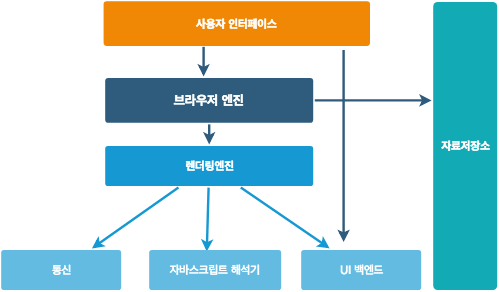

# 브라우저 구조

### Brouwser Structure

브라우저 주요 구성요소 7가지

* **사용자 인터페이스\(User Interface\)**

  주소표시줄, 이전/다음 버튼, 북마크 메뉴 등 요청한 페이지를 보여주는 창을 제외한 나머지 모든 부분

* **브라우저 엔진\(Browser Engine\)**

  사용자 인터페이스와 렌더링 엔진 사이의 동작을 제어

* **렌더링 엔진\(Rendering Engine\)**

  사용자 인터페이스에서 요청한 콘텐츠를 표시. 예를 들어 HTML을 요청하면 HTML을 파싱하여 화면에 표시

* **통신\(Networking\)**

  HTTP Request와 같은 네트워크 호출에 사용. 플랫폼에 독립적인 인터페이스고 플랫폼 하부에서 실행

* **UI 백엔드\(UI Backend\)**

  콤보박스와 창같은 기본 장치를 그림. 플랫폼에서 명시하지 않은 일반적인 인터페이스로서, OS의 UI체계를 사용

* **자바스크립트 해석기\(JavaScript Interpreter\)**

  자바스크립트 코드를 해석하고 실행

* **자료 저장소\(Data Persistence\)**

  쿠키를 저장하는 것과 같은 모든 종류의 자원을 하드디스크에 저장하는 공간. 

  제공되는 저장소 메커니즘 :  [localStorage](https://developer.mozilla.org/en-US/docs/Web/API/Window/localStorage), [indexDB](https://developer.mozilla.org/en-US/docs/Web/API/IndexedDB_API), [WebSQL](https://en.wikipedia.org/wiki/Web_SQL_Database), [FileSystem](https://developer.mozilla.org/en-US/docs/Web/API/FileSystem)


 **Referrence**

[http://wit.nts-corp.com/2014/03/18/1116](http://wit.nts-corp.com/2014/03/18/1116)


